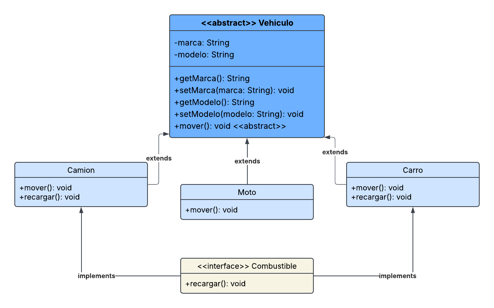

# Herencia y Polimorfismo: Ejercicio con Clases Abstractas

---

## 🚀 Descripción del Proyecto
Este proyecto es un ejercicio practico diseñado para **comprender y aplicar los conceptos de herencia y polimorfismo** en la programación orientada a objetos (POO). A través de la resolución de problemas como este, se busca fortalecer la habilidad de los desarrolladores para crear código **reutilizable, flexible y extensible**.

---

## 👨‍💻 Integrantes del Equipo
- Allan Raul Valentin Acuña
- Fernando Gabriel Gomez Gazo
- Gabriela Michelle Guerrero Paiz
- Steven Leonel Sequeira Reyes
- Guillermo Jose Vega Vega

---

## 🔗 Recursos Adicionales

Diagrama UML del Proyecto

**Enlace al video explicando las List:**

https://drive.google.com/drive/folders/104c2nxUBw7PBzShD5HmuQiORxoPyRXlR?usp=sharing
